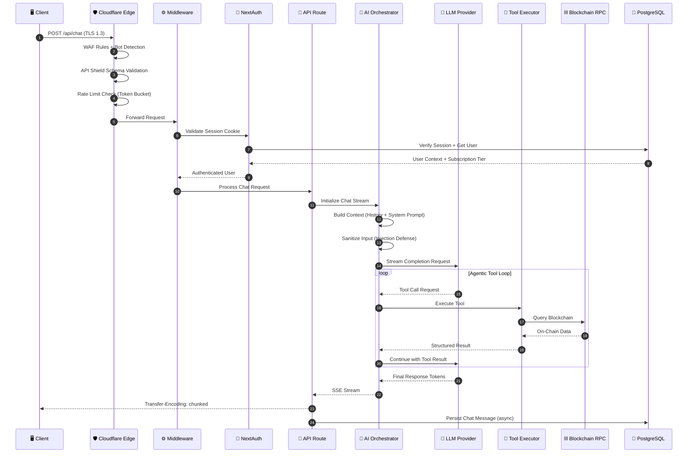
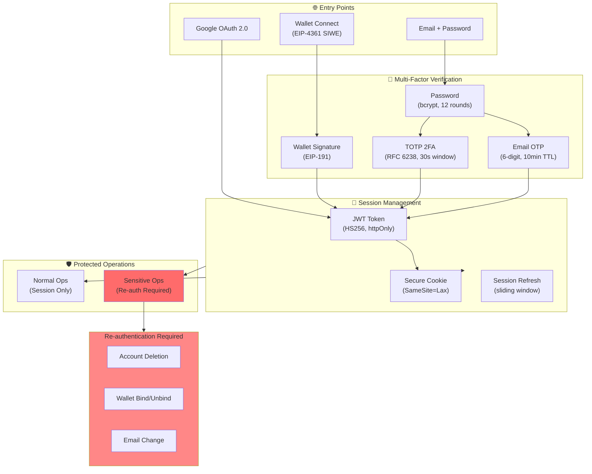
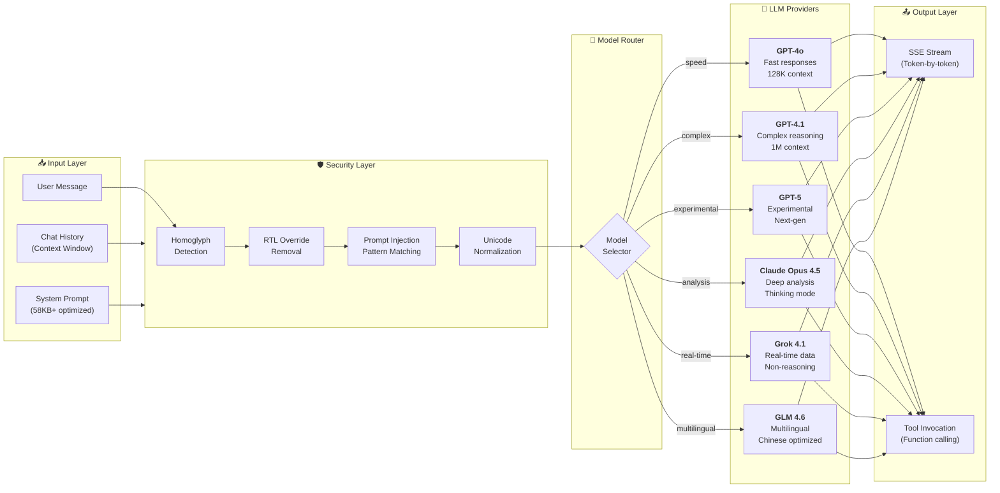
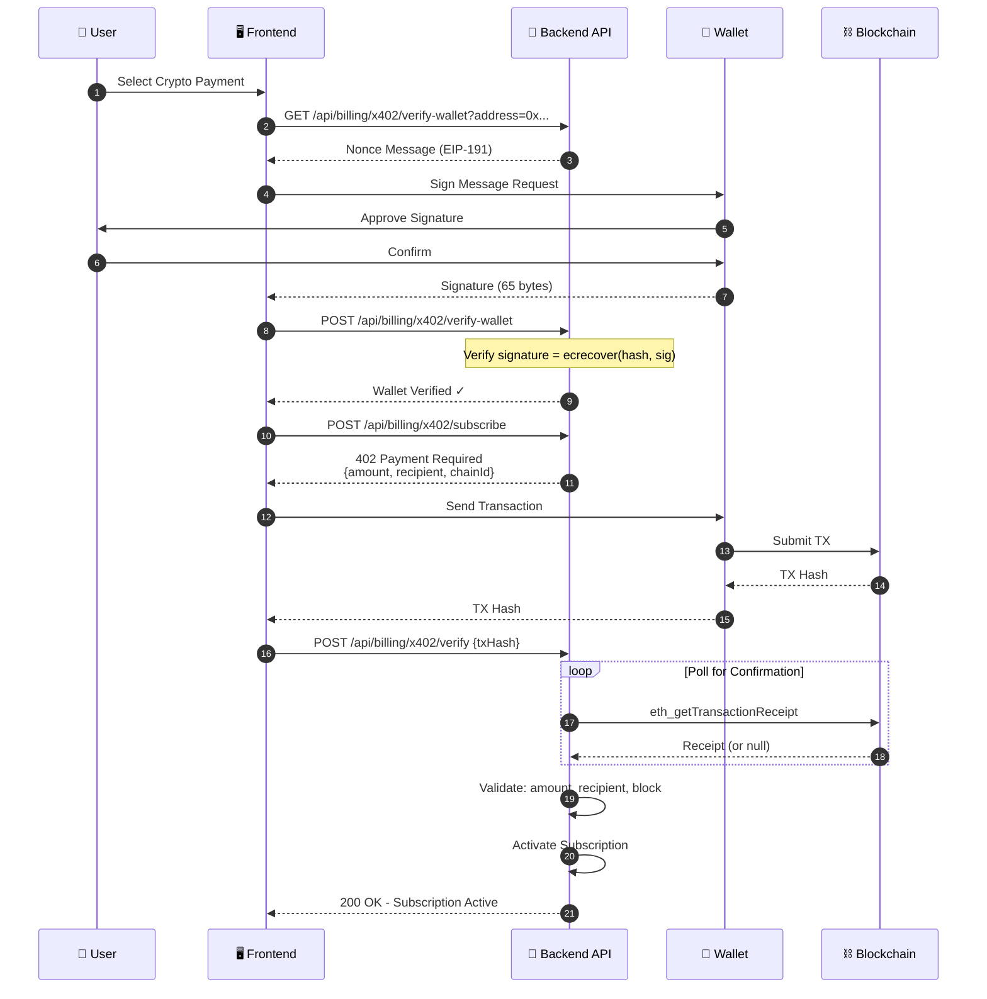

# Barzakh AI

<p align="center">
  
</p>

<p align="center">
  <strong>🧠 AI-Powered Blockchain Intelligence Platform</strong>
</p>

<p align="center">
  <a href="https://chat.barzakh.tech">
    
  </a>
</p>

<p align="center">
  
  
  
  
  
  
  
</p>

---

## Overview

Barzakh AI is a full-stack blockchain analytics platform combining real-time on-chain data with multi-model AI orchestration. Built as a monorepo with Turborepo, it provides intelligent wallet analysis, DeFi insights, and automated blockchain workflows.

### Key Capabilities

- **Multi-Model AI** — GPT-4o, Claude Opus, Grok 4.1, GLM 4.6
- **45+ Blockchain Tools** — Chain-specific analyzers for Cronos, EVM, Aptos, Solana, Flow, SEI
- **x402 Crypto Payments** — Native on-chain payment protocol
- **Enterprise Security** — 2FA, wallet auth, Cloudflare API Shield

## Architecture

> **Monorepo Architecture** built with Turborepo for optimal DX and build performance

### High-Level System Design

```
┌─────────────────────────────────────────────────────────────────────────────────────┐
│                                    EDGE LAYER                                        │
│  ┌─────────────────┐  ┌─────────────────┐  ┌─────────────────┐  ┌─────────────────┐ │
│  │   Cloudflare    │  │   API Shield    │  │  Rate Limiter   │  │    R2 Storage   │ │
│  │   WAF + DDoS    │  │ OpenAPI 3.0 Spec│  │  Token Bucket   │  │   Object Store  │ │
│  └────────┬────────┘  └────────┬────────┘  └────────┬────────┘  └────────┬────────┘ │
└───────────┼─────────────────────┼─────────────────────┼─────────────────────┼────────┘
            │                     │                     │                     │
            ▼                     ▼                     ▼                     ▼
┌─────────────────────────────────────────────────────────────────────────────────────┐
│                              APPLICATION LAYER (Vercel)                              │
│  ┌─────────────────────────────────────────────────────────────────────────────────┐│
│  │                         Next.js 15 (App Router)                                 ││
│  │  ┌─────────────┐  ┌─────────────┐  ┌─────────────┐  ┌─────────────────────────┐ ││
│  │  │   React 18  │  │   Server    │  │  API Routes │  │    Middleware Chain     │ ││
│  │  │     RSC     │  │  Components │  │   (Edge)    │  │  Auth → Rate → Validate │ ││
│  │  └─────────────┘  └─────────────┘  └─────────────┘  └─────────────────────────┘ ││
│  └─────────────────────────────────────────────────────────────────────────────────┘│
└─────────────────────────────────────────────────────────────────────────────────────┘
            │                     │                     │                     │
            ▼                     ▼                     ▼                     ▼
┌─────────────────────────────────────────────────────────────────────────────────────┐
│                                   CORE SERVICES                                      │
│  ┌─────────────────┐  ┌─────────────────┐  ┌─────────────────┐  ┌─────────────────┐ │
│  │  Chat Engine    │  │ AI Orchestrator │  │  Tool Executor  │  │ Stream Processor│ │
│  │  Vercel AI SDK  │  │  Multi-Model    │  │   45+ Tools     │  │   SSE/Chunks    │ │
│  └────────┬────────┘  └────────┬────────┘  └────────┬────────┘  └────────┬────────┘ │
└───────────┼─────────────────────┼─────────────────────┼─────────────────────┼────────┘
            │                     │                     │                     │
            ▼                     ▼                     ▼                     ▼
┌─────────────────────────────────────────────────────────────────────────────────────┐
│                                   AI LAYER                                           │
│  ┌───────────────────────────────────────────────────────────────────────────────┐  │
│  │                           LLM Provider Abstraction                             │  │
│  │  ┌──────────┐  ┌──────────┐  ┌──────────┐  ┌──────────┐  ┌──────────────────┐ │  │
│  │  │  OpenAI  │  │Anthropic │  │   xAI    │  │  Zhipu   │  │   CometAPI       │ │  │
│  │  │GPT-4o/4.1│  │  Claude  │  │  Grok    │  │  GLM 4.6 │  │  (Aggregator)    │ │  │
│  │  │  GPT-5   │  │Opus 4.5  │  │   4.1    │  │          │  │                  │ │  │
│  │  └──────────┘  └──────────┘  └──────────┘  └──────────┘  └──────────────────┘ │  │
│  └───────────────────────────────────────────────────────────────────────────────┘  │
│  ┌─────────────────┐  ┌─────────────────┐  ┌─────────────────────────────────────┐  │
│  │ Prompt Engineer │  │ Input Sanitizer │  │        Response Streamer            │  │
│  │  System Prompts │  │ Injection Guard │  │    Token-by-Token SSE Output        │  │
│  └─────────────────┘  └─────────────────┘  └─────────────────────────────────────┘  │
└─────────────────────────────────────────────────────────────────────────────────────┘
            │                     │                     │                     │
            ▼                     ▼                     ▼                     ▼
┌─────────────────────────────────────────────────────────────────────────────────────┐
│                              BLOCKCHAIN TOOLS LAYER                                  │
│  ┌─────────────────────────────────────────────────────────────────────────────────┐│
│  │                         Chain-Specific Tool Modules                              ││
│  │  ┌──────────┐  ┌──────────┐  ┌──────────┐  ┌──────────┐  ┌──────────────────┐  ││
│  │  │  Cronos  │  │   EVM    │  │  Aptos   │  │   Flow   │  │       SEI        │  ││
│  │  │ zkEVM +  │  │ Ethereum │  │   Sui    │  │ Cadence  │  │  Cosmos SDK      │  ││
│  │  │  EVM     │  │ Polygon  │  │  Move    │  │  FCL     │  │  IBC Transfers   │  ││
│  │  └──────────┘  └──────────┘  └──────────┘  └──────────┘  └──────────────────┘  ││
│  └─────────────────────────────────────────────────────────────────────────────────┘│
│  ┌─────────────────────────────────────────────────────────────────────────────────┐│
│  │                            Utility Tool Modules                                  ││
│  │  ┌──────────┐  ┌──────────┐  ┌──────────┐  ┌──────────┐  ┌──────────────────┐  ││
│  │  │DeFi Llama│  │Web Search│  │  News    │  │ X/Twitter│  │  Image Gen       │  ││
│  │  │   TVL    │  │  Tavily  │  │  Search  │  │  Search  │  │  Gemini 2.5      │  ││
│  │  └──────────┘  └──────────┘  └──────────┘  └──────────┘  └──────────────────┘  ││
│  └─────────────────────────────────────────────────────────────────────────────────┘│
└─────────────────────────────────────────────────────────────────────────────────────┘
            │                     │                     │                     │
            ▼                     ▼                     ▼                     ▼
┌─────────────────────────────────────────────────────────────────────────────────────┐
│                                  DATA LAYER                                          │
│  ┌─────────────────┐  ┌─────────────────┐  ┌─────────────────┐  ┌─────────────────┐ │
│  │   PostgreSQL    │  │  Cloudflare R2  │  │   Drizzle ORM   │  │   Connection    │ │
│  │   (Neon/Turso)  │  │  Object Storage │  │   Type-Safe     │  │    Pooling      │ │
│  └─────────────────┘  └─────────────────┘  └─────────────────┘  └─────────────────┘ │
└─────────────────────────────────────────────────────────────────────────────────────┘
```

### Request Lifecycle



### Authentication & Security Architecture



### Multi-Chain Integration Matrix

| Chain | SDK | Network | RPC Provider | Capabilities |
|-------|-----|---------|--------------|--------------|
| **Cronos** | `ethers.js v6` | Cronos Mainnet | Cronos RPC | EVM transactions, CRC-20 tokens, DeFi protocols |
| **Ethereum** | `ethers.js v6` | Mainnet | Infura/Alchemy | ENS resolution, ERC-20/721/1155, Uniswap |
| **Polygon** | `ethers.js v6` | PoS Mainnet | QuickNode | Low-cost transactions, NFT marketplaces |
| **Aptos** | `@aptos-labs/ts-sdk` | Mainnet | Aptos Fullnode | Move resources, coin balances, modules |
| **Flow** | `@onflow/fcl` | Mainnet | Flow Access Node | Cadence scripts, NFT collections |
| **SEI** | `@sei-js/core` | Pacific-1 | SEI RPC | Cosmos SDK queries, IBC transfers |
| **Wormhole** | Custom | Multi-chain | Guardian Network | Cross-chain message verification |

### AI Security & Threat Protection

```
┌─────────────────────────────────────────────────────────────────────────────────────┐
│                           AI SECURITY DEFENSE LAYERS                                 │
├─────────────────────────────────────────────────────────────────────────────────────┤
│                                                                                      │
│  ┌─────────────────────────────────────────────────────────────────────────────┐    │
│  │  LAYER 1: INPUT SANITIZATION                                                │    │
│  │  ┌─────────────┐ ┌─────────────┐ ┌─────────────┐ ┌─────────────────────────┐│    │
│  │  │ Homoglyph   │ │ Invisible   │ │ RTL/LTR     │ │ Unicode Normalization   ││    │
│  │  │ Detection   │ │ Char Strip  │ │ Override    │ │ (NFC/NFKC)             ││    │
│  │  │ (Lookalikes)│ │ (U+200B,etc)│ │ Removal     │ │                        ││    │
│  │  └─────────────┘ └─────────────┘ └─────────────┘ └─────────────────────────┘│    │
│  └─────────────────────────────────────────────────────────────────────────────┘    │
│                                         │                                            │
│                                         ▼                                            │
│  ┌─────────────────────────────────────────────────────────────────────────────┐    │
│  │  LAYER 2: PROMPT INJECTION DEFENSE                                          │    │
│  │  ┌─────────────┐ ┌─────────────┐ ┌─────────────┐ ┌─────────────────────────┐│    │
│  │  │ Direct      │ │ Indirect    │ │ Jailbreak   │ │ Role/Context           ││    │
│  │  │ Injection   │ │ Injection   │ │ Pattern     │ │ Manipulation           ││    │
│  │  │ Detection   │ │ (via URLs)  │ │ Matching    │ │ Prevention             ││    │
│  │  └─────────────┘ └─────────────┘ └─────────────┘ └─────────────────────────┘│    │
│  └─────────────────────────────────────────────────────────────────────────────┘    │
│                                         │                                            │
│                                         ▼                                            │
│  ┌─────────────────────────────────────────────────────────────────────────────┐    │
│  │  LAYER 3: MEDIA & FILE PROTECTION                                           │    │
│  │  ┌─────────────┐ ┌─────────────┐ ┌─────────────┐ ┌─────────────────────────┐│    │
│  │  │ Polyglot    │ │ EXIF/Meta   │ │ Steganography│ │ File Type             ││    │
│  │  │ Image       │ │ Data Strip  │ │ Detection    │ │ Validation            ││    │
│  │  │ Detection   │ │             │ │              │ │ (Magic Bytes)         ││    │
│  │  └─────────────┘ └─────────────┘ └─────────────┘ └─────────────────────────┘│    │
│  └─────────────────────────────────────────────────────────────────────────────┘    │
│                                         │                                            │
│                                         ▼                                            │
│  ┌─────────────────────────────────────────────────────────────────────────────┐    │
│  │  LAYER 4: MODEL PROTECTION                                                   │    │
│  │  ┌─────────────┐ ┌─────────────┐ ┌─────────────┐ ┌─────────────────────────┐│    │
│  │  │ Sponge      │ │ Model       │ │ Model       │ │ Output                 ││    │
│  │  │ Attack      │ │ Extraction  │ │ Inversion   │ │ Filtering              ││    │
│  │  │ Prevention  │ │ Defense     │ │ Guard       │ │ (PII, Secrets)         ││    │
│  │  └─────────────┘ └─────────────┘ └─────────────┘ └─────────────────────────┘│    │
│  └─────────────────────────────────────────────────────────────────────────────┘    │
│                                                                                      │
└─────────────────────────────────────────────────────────────────────────────────────┘
```

#### Threat Protection Matrix

| Threat Category | Attack Vector | Defense Mechanism |
|-----------------|---------------|-------------------|
| **Prompt Injection** | Direct system prompt override | Pattern matching, input boundary enforcement |
| **Indirect Injection** | Malicious content via URLs/files | Content isolation, sandboxed parsing |
| **Jailbreak Attempts** | Role manipulation, DAN prompts | System prompt hardening, output monitoring |
| **Homoglyph Attacks** | Lookalike Unicode characters | Character normalization, visual similarity detection |
| **Invisible Characters** | Zero-width chars (U+200B, U+FEFF) | Whitespace stripping, control char removal |
| **RTL Override** | Bidirectional text manipulation | Unicode Bidi control removal |
| **Polyglot Files** | Images containing executable code | Magic byte validation, metadata stripping |
| **Steganography** | Hidden data in image pixels | Re-encoding, EXIF removal |
| **Sponge Attacks** | DoS via expensive computations | Token limits, complexity analysis, timeouts |
| **Model Extraction** | Query-based model stealing | Rate limiting, query pattern analysis |
| **Model Inversion** | Training data reconstruction | Output perturbation, access controls |
| **Data Exfiltration** | PII/secrets in AI outputs | Output filtering, regex-based redaction |

### AI Model Configuration



### x402 Crypto Payment Protocol



### Infrastructure Topology

```
┌─────────────────────────────────────────────────────────────────────────────┐
│                              CLOUDFLARE EDGE                                 │
│  ┌────────────────────────────────────────────────────────────────────────┐ │
│  │  WAF │ DDoS Protection │ API Shield │ Rate Limiting │ Bot Management  │ │
│  └────────────────────────────────────────────────────────────────────────┘ │
│  ┌────────────────────────────────────────────────────────────────────────┐ │
│  │                         Cloudflare R2                                  │ │
│  │              (Object Storage - Images, Files, Attachments)             │ │
│  └────────────────────────────────────────────────────────────────────────┘ │
└─────────────────────────────────────────────────────────────────────────────┘
                                     │
                                     ▼
┌─────────────────────────────────────────────────────────────────────────────┐
│                              VERCEL PLATFORM                                 │
│  ┌─────────────────────┐  ┌─────────────────────┐  ┌─────────────────────┐ │
│  │   Edge Functions    │  │  Serverless Fns     │  │    Static Assets    │ │
│  │   (Middleware)      │  │  (API Routes)       │  │    (CDN Cached)     │ │
│  │   < 1ms cold start  │  │  Node.js Runtime    │  │    Global Edge      │ │
│  └─────────────────────┘  └─────────────────────┘  └─────────────────────┘ │
└─────────────────────────────────────────────────────────────────────────────┘
                                     │
                    ┌────────────────┴────────────────┐
                    ▼                                 ▼
┌─────────────────────────────┐      ┌─────────────────────────────┐
│      POSTGRESQL (Neon)      │      │     EXTERNAL SERVICES       │
│  ┌───────────────────────┐  │      │  ┌───────────────────────┐  │
│  │   Connection Pooling  │  │      │  │   Zerion Portfolio    │  │
│  │   Drizzle ORM         │  │      │  │   DeFi Llama TVL      │  │
│  │   Prepared Statements │  │      │  │   CometAPI (LLM)      │  │
│  │   Automatic Backups   │  │      │  │   OpenAI / Anthropic  │  │
│  └───────────────────────┘  │      │  └───────────────────────┘  │
└─────────────────────────────┘      └─────────────────────────────┘
```

---

## Tech Stack

| Layer | Technologies |
|-------|-------------|
| **Frontend** | Next.js 15, React 18, TypeScript, TailwindCSS, Radix UI |
| **Backend** | Next.js API Routes, Vercel AI SDK, PostgreSQL (Drizzle ORM) |
| **AI** | OpenAI, Anthropic Claude, xAI Grok, Zhipu GLM |
| **Auth** | NextAuth.js, TOTP 2FA, Wallet Connect, OAuth |
| **Payments** | Stripe, x402 Protocol (on-chain) |
| **Infra** | Vercel, Cloudflare, Turso/PlanetScale |

---

## Project Structure

```
barzakh-ai/
├── apps/
│   ├── frontend/                 # Next.js 15 application
│   │   ├── app/
│   │   │   ├── (auth)/           # Auth pages (login, register, 2FA)
│   │   │   ├── (chat)/           # Chat interface
│   │   │   └── api/              # API routes
│   │   │       ├── 2fa/          # Two-factor auth
│   │   │       ├── auth/         # NextAuth handlers
│   │   │       ├── billing/      # Stripe + x402
│   │   │       ├── settings/     # User preferences
│   │   │       └── webhooks/     # External integrations
│   │   ├── components/           # React components
│   │   │   ├── Input/            # Chat input system
│   │   │   ├── settings/         # Settings UI
│   │   │   └── ui/               # Radix UI primitives
│   │   └── lib/
│   │       └── db/               # Drizzle ORM schema
│   │
│   └── backend/                  # Supplementary backend services
│
├── packages/
│   └── shared/                   # Shared utilities
│       └── src/lib/
│           ├── ai/
│           │   ├── models.ts     # Model configurations
│           │   ├── prompts.ts    # System prompts
│           │   └── tools/        # 45+ blockchain tools
│           │       ├── aptos/    # Aptos-specific
│           │       ├── solana/   # Solana-specific
│           │       ├── evm/      # EVM chains
│           │       ├── flow/     # Flow blockchain
│           │       ├── sei/      # SEI chain
│           │       └── onchain/  # Cross-chain utils
│           └── security/         # Input sanitization
│
├── docs/
│   ├── cloudflare-api-schema.yaml  # OpenAPI spec
│   └── cloudflare-api-schema.json
│
├── turbo.json                    # Turborepo config
├── pnpm-workspace.yaml
└── package.json
```

---

## Development

### Prerequisites

- Node.js 18+
- pnpm 8+
- PostgreSQL 15+

### Quick Start

```bash
# Install dependencies
pnpm install

# Set up environment
cp apps/frontend/.env.example apps/frontend/.env.local

# Run database migrations
pnpm --filter frontend db:migrate

# Start development server
pnpm dev
```

### Environment Variables

```env
# Database
DATABASE_URL=postgresql://...

# Auth
NEXTAUTH_SECRET=...
NEXTAUTH_URL=http://localhost:3000

# AI Providers
OPENAI_API_KEY=...
COMETAPI_API_KEY=...

# Payments
STRIPE_SECRET_KEY=...
STRIPE_WEBHOOK_SECRET=...

# External APIs
ZERION_API_KEY=...
```

### Commands

| Command | Description |
|---------|-------------|
| `pnpm dev` | Start all apps in dev mode |
| `pnpm build` | Build all apps |
| `pnpm lint` | Lint all packages |
| `pnpm --filter frontend dev` | Run frontend only |
| `pnpm --filter frontend db:push` | Push schema changes |
| `pnpm --filter frontend db:studio` | Open Drizzle Studio |

---

## API Documentation

Full OpenAPI 3.0 specification available in `/docs/`:

### Key Endpoints

| Endpoint | Method | Description |
|----------|--------|-------------|
| `/api/auth/*` | * | NextAuth handlers |
| `/api/2fa/*` | POST | Two-factor authentication |
| `/api/billing/subscription` | GET | Subscription status |
| `/api/billing/x402/*` | * | Crypto payments |
| `/api/settings` | GET/PATCH | User settings |
| `/api/settings/wallet/*` | * | Wallet binding |

---

## Security

### Authentication Layers
- Session-based auth (NextAuth.js)
- OAuth providers (Google)
- Wallet signature verification
- TOTP-based 2FA

### API Protection
- Cloudflare API Shield with OpenAPI schema validation
- Rate limiting per endpoint category
- Input sanitization (prompt injection defense)

### Sensitive Operations
- Re-authentication required for:
  - Account deletion
  - Wallet binding/unbinding
  - Email change

---

## Deployment

### Vercel (Recommended)

```bash
# Install Vercel CLI
npm i -g vercel

# Deploy
vercel --prod
```

### Environment Configuration

| Environment | URL | Branch |
|-------------|-----|--------|
| Production | chat.barzakh.tech | main |
| API Production | staging.barzakh.tech | main |

---

## License

MIT License - see [LICENSE](LICENSE)

---

<p align="center">
  <strong>Built by <a href="https://github.com/sirath-network">Sirath Network</a></strong>
</p>
