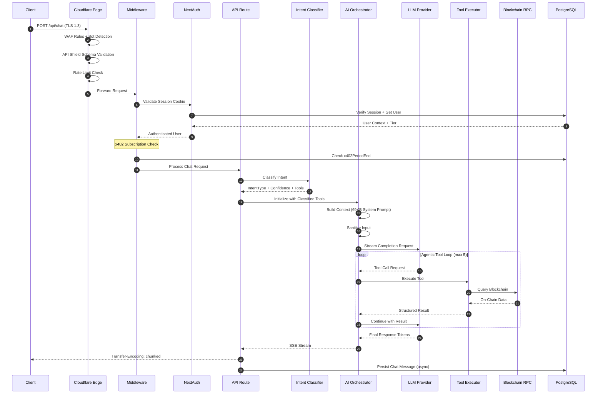
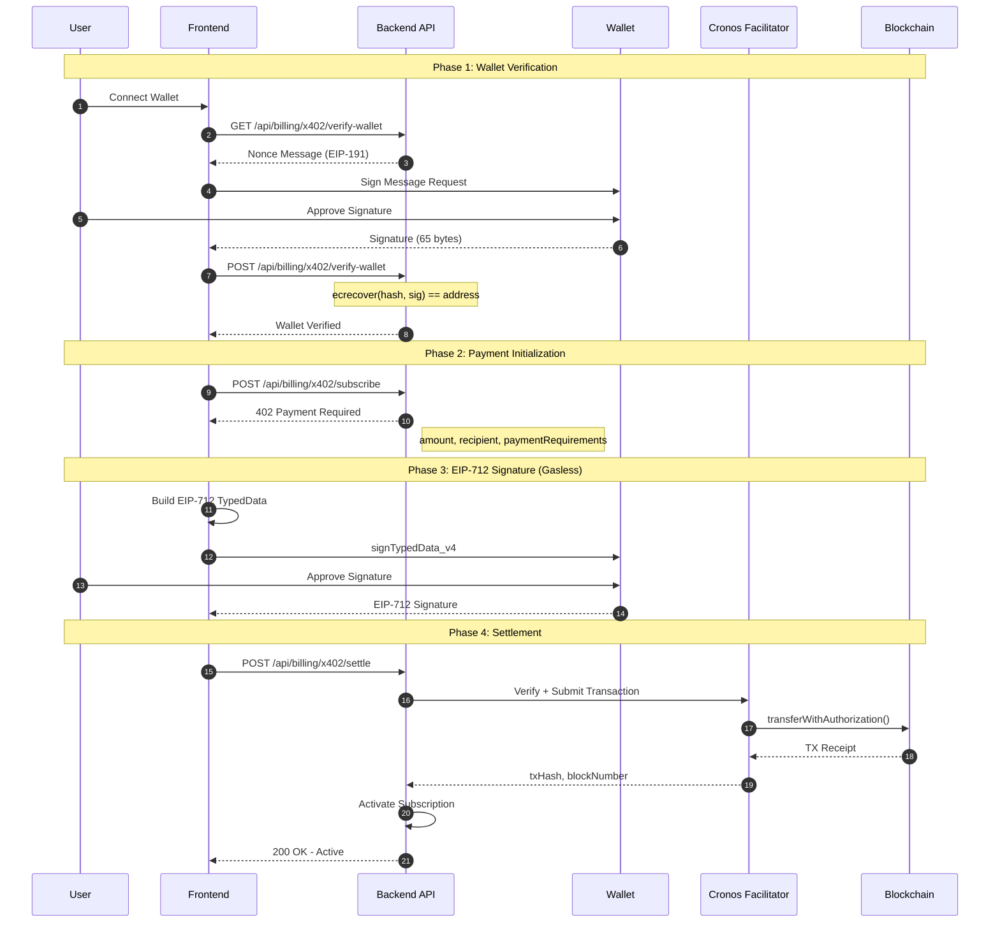
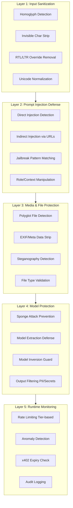
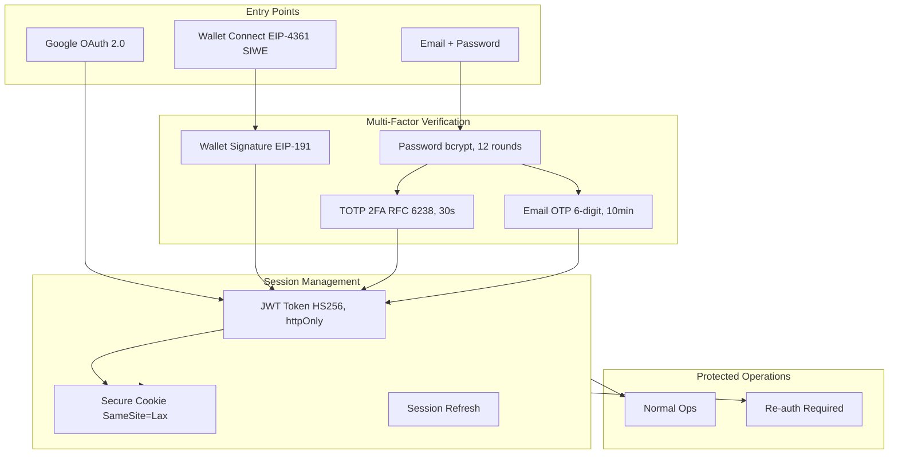
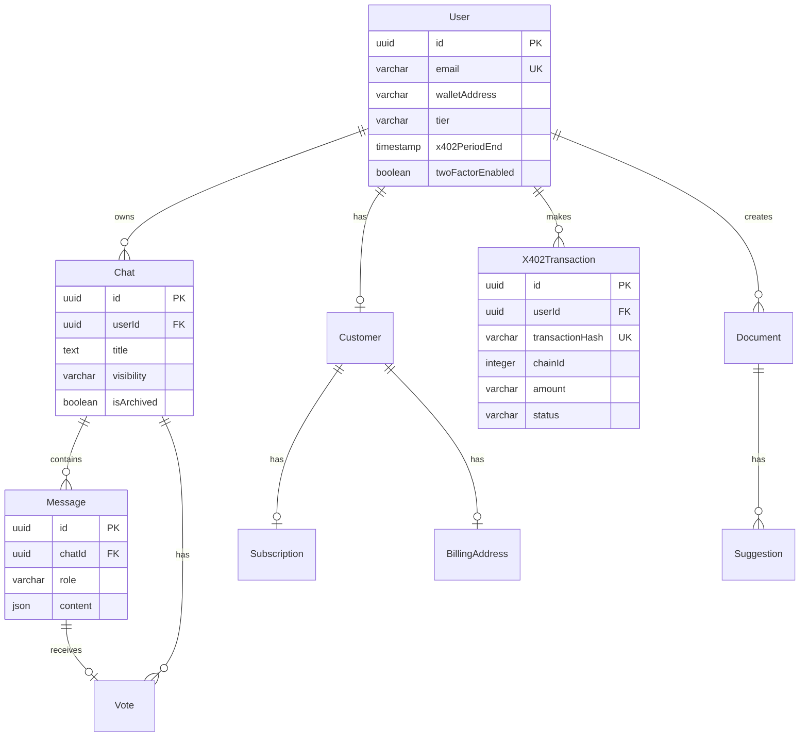
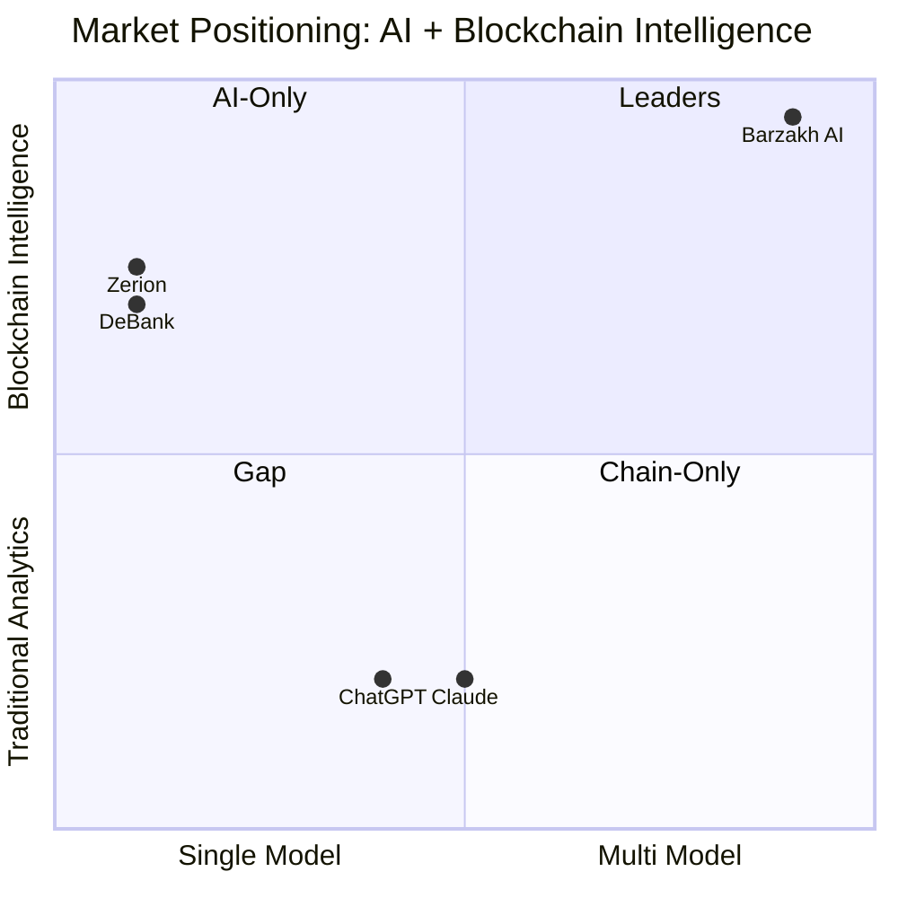

# Barzakh AI: Technical Whitepaper

<p align="center">
  <strong>The Future of AI-Powered Blockchain Intelligence</strong>
</p>

<p align="center">
  <em>Version 1.0 | December 2025</em>
</p>

<p align="center">
  
  
  
</p>

---

## Table of Contents

1. [Executive Summary](#executive-summary)
2. [Problem Statement](#problem-statement)
3. [Solution Architecture](#solution-architecture)
4. [Technical Implementation](#technical-implementation)
5. [AI Orchestration Layer](#ai-orchestration-layer)
6. [Blockchain Integration Framework](#blockchain-integration-framework)
7. [x402 Crypto Payment Protocol](#x402-crypto-payment-protocol)
8. [Security Architecture](#security-architecture)
9. [Data Architecture](#data-architecture)
10. [Business Model](#business-model)
11. [Competitive Analysis](#competitive-analysis)
12. [Roadmap](#roadmap)
13. [Conclusion](#conclusion)

---

## Executive Summary

**Barzakh AI** is an enterprise-grade, multi-model AI platform that revolutionizes blockchain analytics and DeFi interaction through intelligent orchestration. Built as a production-ready Turborepo monorepo with Next.js 16.1 and React 19, the platform uniquely combines:

- **Multi-Model AI Fusion**: Orchestrates GPT-5.x, Claude Opus 4.5, GLM 4.7, and 6+ frontier models with intelligent intent-based routing
- **50+ Blockchain Tools**: Native integrations across 13+ blockchain ecosystems (Cronos, Mantle, Ethereum, Aptos, Solana, Flow, SEI, Zeta, Monad)
- **x402 Gasless Payments**: Revolutionary EIP-3009 implementation enabling zero-gas cryptocurrency subscriptions on Cronos
- **VVS DEX Integration**: Real-time swap quotes, liquidity pool analysis, and DeFi intelligence from VVS Finance
- **Enterprise Security**: 5-layer defense architecture with prompt injection defense, 2FA, and wallet authentication

The platform processes blockchain queries through a sophisticated intent classification pipeline, automatically routing requests to optimal AI models and chain-specific tool clusters while maintaining conversational context across multi-turn interactions.

### Key Metrics

| Metric | Value |
|--------|-------|
| Blockchain Chains Supported | 13+ |
| AI Models Integrated | 6+ |
| Blockchain Tools | 50+ |
| System Prompt Size | 69KB+ |
| Intent Pattern Rules | 400+ |
| Database Migrations | 26 |

---

## Problem Statement

### The Fragmentation Crisis in Web3

The blockchain ecosystem has grown exponentially, creating unprecedented fragmentation:

1. **Chain Proliferation**: Users must navigate 100+ distinct blockchain networks, each with unique addresses, transaction formats, and tooling requirements.

2. **Tool Overload**: Analyzing a single wallet requires 5-7 different tools (explorers, portfolio trackers, DeFi dashboards), creating cognitive overhead and missed opportunities.

3. **AI Limitations**: Existing AI assistants lack real-time blockchain context, returning stale or fabricated data when queried about on-chain activity.

4. **Payment Friction**: Crypto-native users face ironic barriers when subscribing to Web3 services—forced to use credit cards while holding substantial cryptocurrency.

5. **Security Gaps**: The intersection of AI and blockchain creates novel attack vectors (prompt injection, wallet signature exploitation) that existing solutions fail to address.

### Market Pain Points

| Pain Point | User Quote | Impact |
|------------|------------|--------|
| **Multi-Chain Complexity** | "I have assets on 5 chains but can't see them in one place" | Missed opportunities, poor portfolio management |
| **AI Accuracy** | "ChatGPT gives me outdated/wrong blockchain data every time" | Lost trust, incorrect decisions |
| **Payment Barriers** | "I have $10K in crypto but need a credit card to subscribe" | User friction, lost conversions |
| **Security Concerns** | "I don't trust connecting my wallet to AI platforms" | Low adoption, trust deficit |
| **DeFi Analysis** | "Understanding impermanent loss and pool dynamics takes hours" | Time waste, missed yields |

---

## Solution Architecture

### High-Level System Design

Barzakh AI implements a **6-layer architecture** designed for scalability, security, and extensibility:

```mermaid
flowchart TB
    subgraph Layer1["Layer 1: Edge Security"]
        CF["Cloudflare WAF + DDoS"]
        API["API Shield OpenAPI 3.0"]
        RL["Rate Limiter Token Bucket"]
        R2["R2 Object Storage"]
    end
    
    subgraph Layer2["Layer 2: Application (Vercel)"]
        Next["Next.js 16.1 App Router + RSC"]
        React["React 19 RSC"]
        Server["Server Components"]
        Routes["API Routes Edge"]
        MW["Middleware Chain"]
    end
    
    subgraph Layer3["Layer 3: Core Services"]
        Chat["Chat Engine Vercel AI SDK v4.1.17"]
        Orch["AI Orchestrator Multi-Model Router"]
        Tools["Tool Executor 50+ Tools, 12 Chains"]
        Stream["Stream Processor SSE/Chunks"]
    end
    
    subgraph Layer4["Layer 4: AI Abstraction"]
        OpenAI["OpenAI GPT-4o/5"]
        Anthropic["Anthropic Claude"]
        xAI["xAI Grok"]
        Zhipu["Zhipu GLM-4.7"]
        Comet["CometAPI Aggregator"]
    end
    
    subgraph Layer5["Layer 5: Blockchain Tools"]
        Cronos["Cronos VVS DEX"]
        Mantle["Mantle L2"]
        EVM["EVM Ethereum/Polygon"]
        Aptos["Aptos Move"]
        SEI["SEI Cosmos SDK"]
        Solana["Solana RPC"]
        Zeta["Zeta ZetaVM"]
        Monad["Monad Next Gen"]
    end
    
    subgraph Layer6["Layer 6: Data Persistence"]
        PG["PostgreSQL Neon/Turso"]
        R2S["Cloudflare R2 Object Storage"]
        Drizzle["Drizzle ORM Type-Safe"]
        Pool["Connection Pooling"]
    end
    
    Layer1 --> Layer2
    Layer2 --> Layer3
    Layer3 --> Layer4
    Layer4 --> Layer5
    Layer5 --> Layer6
```



### Technology Stack

| Layer | Technology | Version | Purpose |
|-------|------------|---------|---------|
| **Runtime** | Node.js | 18+ | Server runtime |
| **Package Manager** | pnpm | 8.6.12 | Fast, disk-efficient |
| **Monorepo** | Turborepo | 2.7.2 | Build orchestration |
| **Framework** | Next.js | 16.1.0 | Full-stack React framework |
| **UI Library** | React | 19.2.0 | UI components (RSC enabled) |
| **Language** | TypeScript | 5.6.3 | Type safety |
| **AI SDK** | Vercel AI | 4.1.17 | Streaming + Tool execution |
| **Database** | PostgreSQL | 15+ | Primary data store |
| **ORM** | Drizzle | 0.34.1 | Type-safe queries |
| **Web3** | Wagmi + Viem | 2.19.5 / 2.41.2 | Wallet integration |
| **Auth** | NextAuth.js | 5.0.0-beta.30 | Multi-provider auth |

---

## Technical Implementation

### Monorepo Architecture

Barzakh AI uses a **Turborepo monorepo** with pnpm workspaces for optimal developer experience and build performance:

| Directory | Purpose |
|-----------|---------|
| `apps/frontend/` | Next.js 16.1 Application |
| `apps/frontend/app/(auth)/` | Auth pages (login, register, 2FA) |
| `apps/frontend/app/(chat)/` | Chat interface + API routes |
| `apps/frontend/app/api/billing/x402/` | Crypto payment endpoints |
| `apps/frontend/lib/db/` | Drizzle ORM + schema |
| `packages/shared/` | Shared utilities (@barzakh/shared) |
| `packages/shared/src/lib/ai/` | AI models, prompts, tools |
| `packages/shared/src/lib/ai/tools/` | 50+ blockchain tools (12+ chains) |
| `docs/` | OpenAPI specs + documentation |

### Request Lifecycle

Every user interaction follows a carefully orchestrated pipeline:



---

## AI Orchestration Layer

### Multi-Model Provider Architecture

Barzakh AI implements a **custom provider abstraction** supporting 6+ frontier AI models:

```typescript
// Model Configuration (models.ts)
import { openai } from "@ai-sdk/openai";
import { createOpenAI } from "@ai-sdk/openai";
import { customProvider } from "ai";

const cometai = createOpenAI({
  baseURL: "https://api.cometapi.com/v1",
  apiKey: process.env.COMETAPI_API_KEY,
});

export const myProvider = customProvider({
  languageModels: {
    "openai-gpt-4o": openai("gpt-4o"),
    "openai-gpt-4.1": openai("gpt-4.1-2025-04-14"),
    "openai-gpt-5.1": cometai("gpt-5.1"),
    "openai-gpt-5.2": cometai("gpt-5.2"),
    "anthropic-opus-4.5": cometai("claude-opus-4-5-20251101-thinking"),
    "anthropic-haiku-4.5": cometai("claude-haiku-4-5-20251001"),
    "google-gemini-3-flash": cometai("gemini-3-flash"),
    "google-gemini-2.5-flash-preview": cometai("google-gemini-2.5-flash-preview"),
    "xai-grok-4.1-fast": cometai("grok-4-1-fast-non-reasoning"),
    "zai-glm-4.7": cometai("glm-4.7"),

    "title-model": openai("gpt-4-turbo"),
    "block-model": openai("gpt-4o"),
  },
});
```

### Model Capabilities Matrix

| Model ID | Display Name | Provider | Strength | Use Case |
|----------|--------------|----------|----------|----------|
| `openai-gpt-4o` | **GPT 4o** | OpenAI | Speed | Fast queries, simple tasks |
| `openai-gpt-4.1` | **GPT 4.1** | OpenAI | Reasoning | Multi-step analysis |
| `openai-gpt-5.1` | **GPT 5.1** | CometAPI | Frontier | Complex blockchain analysis |
| `openai-gpt-5.2` | **GPT 5.2** | CometAPI | Advanced | Research-grade tasks |
| `zai-glm-4.7` | **GLM 4.7** | CometAPI | Multilingual | broad coverage |
| `anthropic-haiku-4.5` | **Claude Haiku 4.5** | CometAPI | Speed | Fast, lightweight tasks |
| `anthropic-opus-4.5` | **Claude Opus 4.5 Thinking** | CometAPI | Deep Analysis | Code generation, extended reasoning |
| `google-gemini-3-flash` | **Gemini 3 Flash** | CometAPI | Speed | Fast Gemini responses |
| `google-gemini-2.5-flash-preview` | **Gemini 2.5 Flash Preview** | CometAPI | Preview | Experimental tasks |
| `xai-grok-4.1-fast` | **Grok 4.1 Fast** | CometAPI | Speed | Fast reasoning |


### Intent Classification System

The platform implements a **hybrid intent classification** system (698 lines) that routes queries to optimal tool clusters:

```mermaid
flowchart LR
    subgraph Input["User Input"]
        Query["User Query"]
    end
    
    subgraph Classification["Intent Classification"]
        Pattern["Pattern Matching"]
        Context["Context Check"]
        LLM["LLM Fallback"]
    end
    
    subgraph Scoring["Confidence Scoring"]
        Regex["+0.4 per regex match"]
        Keyword["+0.3 per keyword"]
        Priority["+0.0-0.2 priority bonus"]
        Threshold["Threshold: 0.6"]
    end
    
    subgraph Intents["Intent Types"]
        Imagine["imagine (100)"]
        Aptos["aptos (95)"]
        Cronos["cronos (95)"]
        SEI["sei (95)"]
        Solana["solana (95)"]
        OnChain["on_chain (90)"]
        Coding["coding (80)"]
        Search["search (10)"]
    end
    
    Query --> Pattern
    Pattern -->|"High Confidence"| Intents
    Pattern -->|"Low Confidence"| Context
    Context -->|"Chain Context?"| Intents
    Context -->|"No Context"| LLM
    LLM --> Intents
    
    Scoring --> Pattern
```



### Chain-Specific Pattern Examples

```typescript
// Cronos Detection Patterns (intent-classifier.ts)
{
    intent: "cronos",
    patterns: [
        /\bcronos\b/i,
        /\bcro\s+(token|coin|balance|wallet|portfolio)\b/i,
        /\bcrypto\.com\s+(chain|defi)\b/i,
        /\bvvs\s+(finance|swap|dex)\b/i,
        /\b(on|at|for)\s+cronos\b/i,
    ],
    keywords: [
        "cronos", "cro token", "crypto.com chain",
        "vvs finance", "cronos wallet", "on cronos",
    ],
    priority: 95,
}
```

### Model Forcing Rules

Certain intents require specific models for optimal results:

```typescript
export const FORCED_MODEL_BY_GROUP = {
    coding: "anthropic-opus-4.5",    // Claude for code generation
    imagine: "openai-gpt-4.1",    // GPT-4.1 for image prompts
    // Chain tools use user-selected model
};
```

---

## Blockchain Integration Framework

### Multi-Chain Tool Architecture

The platform provides **50+ specialized tools** across 12+ blockchain ecosystems:

#### Cronos Ecosystem Tools

| Tool | Function |
|------|----------|
| `getCronosBalance` | Native CRO balance |
| `getCronosTokenBalances` | CRC-20 token list |
| `getCronosTransactions` | Transaction history |
| `getCronosGasOracle` | Gas price estimates |
| `getCronosMarketData` | Price & volume data |
| `getCronosTokenHolders` | Token holder analysis |
| `getCronosContractABI` | Contract ABI retrieval |
| `getCronosContractSource` | Verified source code |
| `initiateX402Payment` | Crypto subscriptions |

#### Aptos Ecosystem Tools

| Tool | Function |
|------|----------|
| `getAptosStats` | Network statistics |
| `getAptosScanApiData` | Explorer API data |
| `aptosNames` | ANS name resolution |
| `getAptosPortfolio` | GraphQL portfolio |
| `getAptosResources` | Account resources |
| `getAptosModules` | Move module info |

#### Utility Tools

| Tool | Function |
|------|----------|
| `webSearch` | Tavily web search |
| `defiLlama` | TVL & yield data |
| `newsSearch` | Crypto news API |
| `xSearch` | X/Twitter search |
| `createImage` | Gemini 2.5 image gen |
| `translateTransactions` | Human-readable TX |

#### Mantle Network Ecosystem Tools

Native L2 support for **Mantle Network** (Chain ID: 5000) with comprehensive portfolio tracking and transaction analysis:

| Tool | Function |
|------|----------|
| `getMantleBalance` | Native MNT balance |
| `getMantlePortfolio` | Complete portfolio with tokens |
| `getMantleTokenList` | ERC-20 token holdings |
| `getMantleTokenBalance` | Specific token balance |
| `getMantleTransactionHistory` | Transaction history with token details |
| `getMantleTokenTransfers` | Token transfer events |
| `getMantleBlockInfo` | Block data |
| `getMantleGasPrice` | Current gas oracle |
| `getMantleContractABI` | Contract ABI retrieval |
| `getMantleContractSource` | Verified source code |
| `getMantleRollupInfo` | L2 rollup status |

### Relay Protocol Cross-Chain Swaps

Native integration with **Relay Protocol** enables cross-chain token swaps across 15+ networks:

| Tool | Function |
|------|----------|
| `getRelaySwapQuote` | Get optimal cross-chain swap quotes |
| `executeRelaySwap` | Execute approved cross-chain swap |
| `getRelaySupportedTokens` | List supported tokens per chain |

```typescript
// Relay Swap Quote Tool (relay/index.ts)
export const getRelaySwapQuote = tool({
    description: "Get a cross-chain swap quote from Relay Protocol.",
    parameters: z.object({
        fromChainId: z.number().describe("Source chain ID"),
        toChainId: z.number().describe("Destination chain ID"),
        fromToken: z.string().describe("Source token address"),
        toToken: z.string().describe("Destination token address"),
        amount: z.string().describe("Amount to swap"),
    }),
    execute: async ({ fromChainId, toChainId, fromToken, toToken, amount }) => {
        // Returns: { quote, route, fees, estimatedTime }
    },
});
```

**Supported Chains**: Ethereum, Base, Optimism, Arbitrum, Polygon, Avalanche, BNB Chain, Scroll, zkSync, Linea, Blast, Mode, Zora, **Mantle**, and more.

**Features**:
- **Swap Completion Tracking**: Server-side persistence prevents duplicate swaps
- **MEV Protection**: Transactions protected via Relay solver network
- **Dynamic Decimals**: Automatic token decimal fetching from Relay Currencies API

### Tool Grouping by Intent

Tools are dynamically selected based on classified intent:

```typescript
const groupTools = {
    cronos: [
        "webSearch",
        "getCronosBalance",
        "getCronosTokenBalances",
        "getCronosTransactions",
        "getCronosGasOracle",
        "getCronosMarketData",
        "getCronosTokenHolders",
        "getCronosContractABI",
        "getCronosContractSource",
        "initiateX402Payment",
        "getSubscriptionInfo",
    ],
    aptos: [
        "webSearch",
        "getAptosStats",
        "getAptosScanApiData",
        "aptosNames",
        "getAptosPortfolio",
        "defiLlama",
    ],
    mantle: [
        "webSearch",
        "getMantleBalance",
        "getMantlePortfolio",
        "getMantleTokenList",
        "getMantleTransactionHistory",
        "getMantleTokenTransfers",
        "getMantleGasPrice",
        "getMantleBlockInfo",
        "getMantleContractABI",
        "getRelayQuote",
    ],
    // ... 10+ more chain groups
};
```

---

## x402 Crypto Payment Protocol

### Overview

The **x402 Protocol** implements gasless cryptocurrency payments using EIP-3009 (TransferWithAuthorization), enabling users to subscribe with USDC on Cronos without paying gas fees.

> **Important**: x402 is the industry's first AI-native crypto subscription system, allowing the AI agent to programmatically suggest subscription upgrades with user approval via wallet signature.

### Protocol Flow



### EIP-3009 TransferWithAuthorization

```typescript
// EIP-712 Domain for USDC.e on Cronos
const domain = {
    name: "Bridged USDC (Stargate)",
    version: "1",
    chainId: 338,  // Cronos Testnet (25 for mainnet)
    verifyingContract: "0xc01efAaF7C5C61bEbFAeb358E1161b537b8bC0e0",
};

// EIP-3009 TransferWithAuthorization Types
const types = {
    TransferWithAuthorization: [
        { name: "from", type: "address" },
        { name: "to", type: "address" },
        { name: "value", type: "uint256" },
        { name: "validAfter", type: "uint256" },
        { name: "validBefore", type: "uint256" },
        { name: "nonce", type: "bytes32" },
    ],
};
```

### AI-Initiated Payment Tool

The AI agent can suggest subscription upgrades through a dedicated tool:

```typescript
// x402-transfer.ts
export const initiateX402Payment = tool({
    description: `Initiate a subscription payment on Cronos using x402 protocol.
    Supports tier changes (pro <-> ultimate) and cycle changes (monthly/quarterly/yearly).`,
    parameters: z.object({
        planId: z.enum(["pro", "ultimate"]),
        billingCycle: z.enum(["monthly", "quarterly", "yearly"]),
        currentTier: z.string().optional(),
        currentBillingCycle: z.string().optional(),
        reason: z.string().optional(),
    }),
    execute: async ({ planId, billingCycle, reason }) => {
        // Validate eligibility, check against duplicate subscriptions
        // Return payment requirements for frontend rendering
    },
});
```

### Subscription Pricing

| Plan | Monthly | Quarterly | Yearly |
|------|---------|-----------|--------|
| **Pro** | $25 USDC | $66 USDC | $240 USDC |
| **Ultimate** | $250 USDC | $660 USDC | $2400 USDC |

### Message Limits by Tier

| Tier | Monthly | Quarterly | Yearly |
|------|---------|-----------|--------|
| **Free** | 10/day | 10/day | 10/day |
| **Pro** | 50/day | 100/day | 150/day |
| **Ultimate** | 250/day | 350/day | 500/day |

---

## Security Architecture

### 5-Layer Defense Model



### Authentication Architecture



### Threat Protection Matrix

| Threat Category | Attack Vector | Defense Mechanism |
|-----------------|---------------|-------------------|
| **Prompt Injection** | System prompt override | Pattern matching, input boundaries |
| **Indirect Injection** | Malicious URLs/files | Content isolation, sandboxed parsing |
| **Jailbreak** | DAN prompts, role manipulation | System prompt hardening |
| **Homoglyph** | Lookalike Unicode | Character normalization |
| **Invisible Chars** | Zero-width (U+200B) | Whitespace stripping |
| **Polyglot Files** | Images with code | Magic byte validation |
| **Sponge Attacks** | DoS via complexity | Token limits, timeouts |
| **Data Exfiltration** | PII in outputs | Regex-based redaction |

---

## Data Architecture

### Database Schema

The platform uses PostgreSQL with Drizzle ORM for type-safe data access:

```typescript
// Core Entities (schema.ts)

export const user = pgTable("User", {
    id: uuid("id").primaryKey().defaultRandom(),
    email: varchar("email", { length: 64 }).unique(),
    walletAddress: varchar("walletAddress", { length: 64 }),
    password: varchar("password", { length: 255 }),  // bcrypt hash
    
    // Profile
    name: text("name"),
    username: text("username").unique(),
    image: text("image"),
    
    // Subscription
    tier: varchar("tier").default("free"),
    billingCycle: varchar("billingCycle").default("monthly"),
    messageCount: integer("messageCount").default(0),
    dailyMessageRemaining: integer("dailyMessageRemaining").default(10),
    
    // 2FA (AES-256-GCM encrypted)
    twoFactorSecret: text("twoFactorSecret"),
    twoFactorEnabled: boolean("twoFactorEnabled").default(false),
    backupCodes: text("backupCodes"),  // bcrypt hashed
    
    // x402
    x402CancelAtPeriodEnd: boolean("x402CancelAtPeriodEnd").default(false),
    x402PeriodEnd: timestamp("x402PeriodEnd"),
});

export const x402_transactions = pgTable("X402Transaction", {
    id: uuid("id").primaryKey().defaultRandom(),
    userId: uuid("userId").references(() => user.id),
    transactionHash: varchar("transactionHash", { length: 66 }).unique(),
    chainId: integer("chainId"),
    amount: varchar("amount", { length: 64 }),
    tokenAddress: varchar("tokenAddress", { length: 42 }),
    senderAddress: varchar("senderAddress", { length: 42 }),
    planId: varchar("planId"),
    billingCycle: varchar("billingCycle"),
    status: varchar("status").default("pending"),
    createdAt: timestamp("createdAt").defaultNow(),
});

export const chat = pgTable("Chat", {
    id: uuid("id").primaryKey().defaultRandom(),
    createdAt: timestamp("createdAt"),
    updatedAt: timestamp("updatedAt").defaultNow(),
    title: text("title"),
    userId: uuid("userId").references(() => user.id),
    visibility: varchar("visibility").default("private"),
    isArchived: boolean("isArchived").default(false),
});

export const message = pgTable("Message", {
    id: uuid("id").primaryKey().defaultRandom(),
    chatId: uuid("chatId").references(() => chat.id),
    role: varchar("role"),
    content: json("content"),
    createdAt: timestamp("createdAt"),
}, (table) => ({
    chatIdIdx: index("idx_message_chat_id").on(table.chatId),
    chatIdCreatedAtIdx: index("idx_message_chat_id_created_at")
        .on(table.chatId, table.createdAt),
}));
```

### Entity Relationship Diagram



---

## Business Model

### Revenue Streams

#### Subscription Tiers

| Tier | Price Range | Features |
|------|-------------|----------|
| **Free** | $0 | 10 messages/day, basic blockchain queries, limited tools |
| **Pro** | $20-$240 | 50-150 messages, all blockchain tools, priority support, VVS DEX |
| **Ultimate** | $250-$2400 | 250-500 messages, GPT-5.x & Claude, all frontier models, API access |

#### Payment Methods

| Method | Technology | Features |
|--------|------------|----------|
| **Stripe** | Credit/Debit Cards | Recurring billing, invoices |
| **x402 Protocol** | USDC on Cronos | Gasless EIP-3009, crypto-native |

### Value Proposition by Stakeholder

| Stakeholder | Pain Point | Barzakh Solution |
|-------------|------------|------------------|
| **Retail Traders** | Multi-chain complexity | Unified AI assistant across 12+ chains |
| **DeFi Users** | Impermanent loss confusion | VVS pool analysis + AI explanations |
| **Developers** | Smart contract research | Instant ABI/source code retrieval |
| **Crypto Natives** | Fiat payment friction | x402 gasless USDC subscriptions |
| **Enterprise** | Security concerns | 5-layer defense + audit logging |

---

## Competitive Analysis

### Market Positioning



### Feature Comparison

| Feature | Barzakh AI | ChatGPT | Claude | DeBank | Zerion |
|---------|------------|---------|--------|--------|--------|
| Multi-Model AI | ✅ 6+ models | ❌ Single | ❌ Single | ❌ None | ❌ None |
| Live Blockchain Data | ✅ Real-time | ❌ Stale | ❌ Stale | ✅ Live | ✅ Live |
| Multi-Chain Support | ✅ 12+ chains | ❌ None | ❌ None | ✅ EVM | ✅ EVM |
| DEX Integration | ✅ VVS | ❌ None | ❌ None | ⚠️ View | ⚠️ View |
| Crypto Payments | ✅ x402 | ❌ None | ❌ None | ❌ None | ❌ None |
| Intent Classification | ✅ Hybrid | ❌ None | ❌ None | N/A | N/A |
| 2FA/Wallet Auth | ✅ Both | ❌ Email | ❌ Email | ✅ Wallet | ✅ Wallet |

---

## Roadmap

### Phase 1: Foundation (Completed ✅)

- [x] Multi-model AI orchestration (GPT-4o to GPT-5.2)
- [x] 50+ blockchain tools across 12+ chains
- [x] x402 gasless payment protocol
- [x] VVS Finance DEX integration
- [x] Intent classification system
- [x] 5-layer security architecture
- [x] 2FA + wallet authentication

### Phase 2: Expansion (Q1 2026)

- [ ] Additional DEX integrations (Uniswap, Jupiter)
- [ ] Cross-chain swap execution (Wormhole)
- [ ] API access for Ultimate tier
- [ ] Mobile-optimized PWA
- [ ] Advanced analytics dashboard

### Phase 3: Enterprise (Q2 2026)

- [ ] Self-hosted deployment options
- [ ] Custom model fine-tuning
- [ ] Dedicated infrastructure
- [ ] SLA-backed support
- [ ] Compliance certifications

### Phase 4: Ecosystem (Q3-Q4 2026)

- [ ] Plugin marketplace
- [ ] Community tool contributions
- [ ] DAO governance integration
- [ ] Token-gated features
- [ ] Cross-platform SDK

---

## Appendix A: API Reference

See [cloudflare-api-schema.yaml](./cloudflare-api-schema.yaml) for the complete OpenAPI 3.0 specification.

## Appendix B: Glossary

| Term | Definition |
|------|------------|
| **x402** | Barzakh's gasless payment protocol using EIP-3009 |
| **EIP-3009** | Ethereum standard for TransferWithAuthorization |
| **EIP-712** | Typed structured data hashing and signing |
| **VVS** | VVS Finance, the leading DEX on Cronos |
| **Intent Classification** | Automatic routing of queries to appropriate tools |
| **SSE** | Server-Sent Events for real-time streaming |
| **RSC** | React Server Components for optimal performance |

## Appendix C: References

1. EIP-3009: Transfer With Authorization - https://eips.ethereum.org/EIPS/eip-3009
2. EIP-712: Typed Structured Data Hashing - https://eips.ethereum.org/EIPS/eip-712
3. Vercel AI SDK Documentation - https://sdk.vercel.ai/docs
4. VVS Finance Developer Docs - https://docs.vvs.finance
5. Cronos Developer Documentation - https://docs.cronos.org


## Conclusion

**Barzakh AI** represents a paradigm shift in blockchain intelligence platforms. By combining multi-model AI orchestration with native multi-chain integration and innovative gasless payment protocols, we deliver an experience that is simultaneously:

- **More Intelligent**: 6+ frontier models with intent-based routing
- **More Connected**: 50+ tools across 12+ blockchain ecosystems
- **More Secure**: 5-layer defense architecture
- **More Accessible**: x402 gasless crypto subscriptions

The platform stands at the intersection of AI advancement and blockchain innovation, creating a new category of **AI-Native Blockchain Intelligence** that serves retail traders, DeFi power users, and enterprise clients alike.

> **Experience Barzakh AI live at [chat.barzakh.tech](https://chat.barzakh.tech)**

---

<p align="center">
  <strong>Built by <a href="https://github.com/sirath-network">Sirath Network</a></strong>
</p>

<p align="center">
  <sub>AI-Powered | Multi-Chain | Security First | Crypto-Native</sub>
</p>